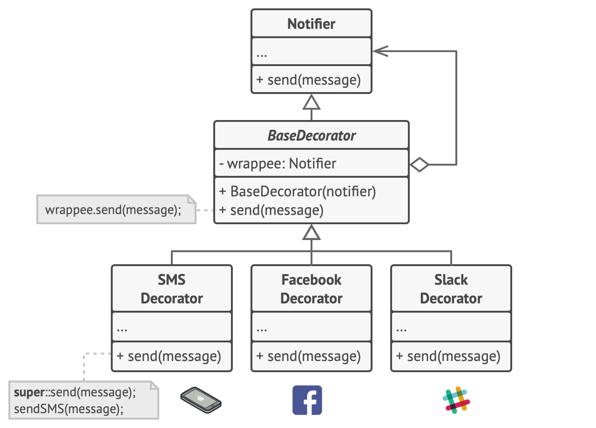
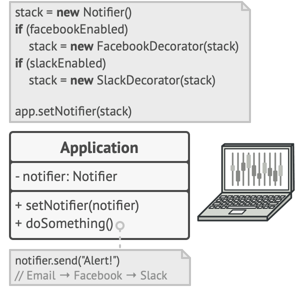

# Decorator Pattern
Decorator is a structural design pattern that lets you attach new behaviors to objects by placing these objects inside special wrapper objects that contain the behaviors.

## Problem
Imagine you opened a pizza shop and support three types of pizza.
- Margherita
- Chicken
- Pepperoni
But then customers want to add extra topping. You start adding in classes like `MargheritaWithExtraCheese`, `ChickenWithExtraCheese`, `PepperoniWithExtraCheese`, `MargheritaWithExtraCheeseAndOlives`, `ChickenWithExtraCheeseAndOlives`, `PepperoniWithExtraCheeseAndOlives`, `MargheritaWithExtraCheeseAndOlivesAndTomato`, `ChickenWithExtraCheeseAndOlivesAndTomato`, `PepperoniWithExtraCheeseAndOlivesAndTomato`, and so on. This is not scalable and maintainable.
- What if you want to add a new type of pizza?
- What if you want to add a new topping?
- What if you want to remove a topping?
Similar example:

## Solution
The Decorator pattern suggests that you take a core object and place it inside a series of decorator objects that add new features to the core object.
Like toppings can be added to a pizza, decorators can be stacked on top of each other, thus allowing each decorator to alter the behavior of the object before passing the result to the next decorator.

