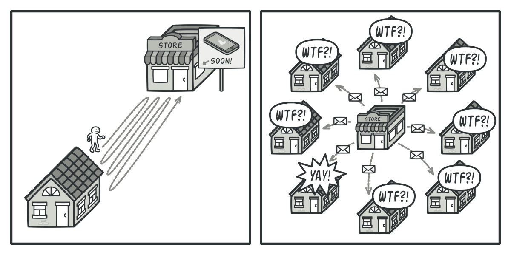
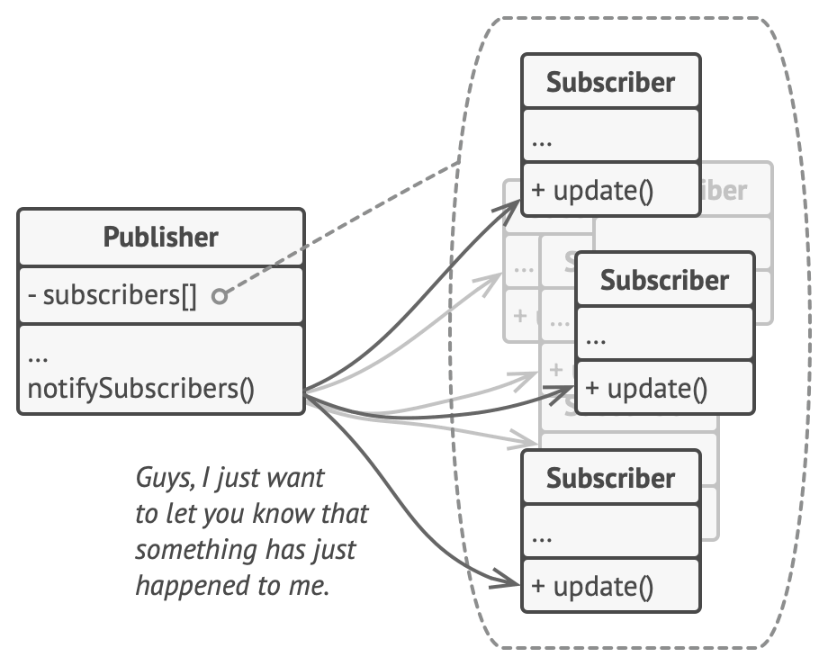

# Observer Design Pattern

## Introduction
Observer is a behavioral design pattern that lets you define a subscription mechanism to notify multiple objects about any events that happen to the object they’re observing.

## Problem

Imagine that you have two types of objects: a Customer and a Store. The customer is very interested in a particular brand of product (say, it’s a new model of the iPhone) which should become available in the store very soon.
The customer could visit the store every day and check product availability. But while the product is still en route, most of these trips would be pointless.
On the other hand, the store could send tons of emails (which might be considered spam) to all customers each time a new product becomes available. This would save some customers from endless trips to the store. At the same time, it’d upset other customers who aren’t interested in new products.
It looks like we’ve got a conflict. Either the customer wastes time checking product availability or the store wastes resources notifying the wrong customers.

## Solution
Store provide function to subscribe, or unsubscribe.
Whenever some change occurs, store provider will notify all the subscribers using their update function.

## Structure:
