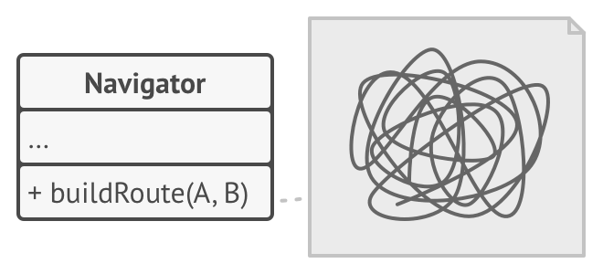
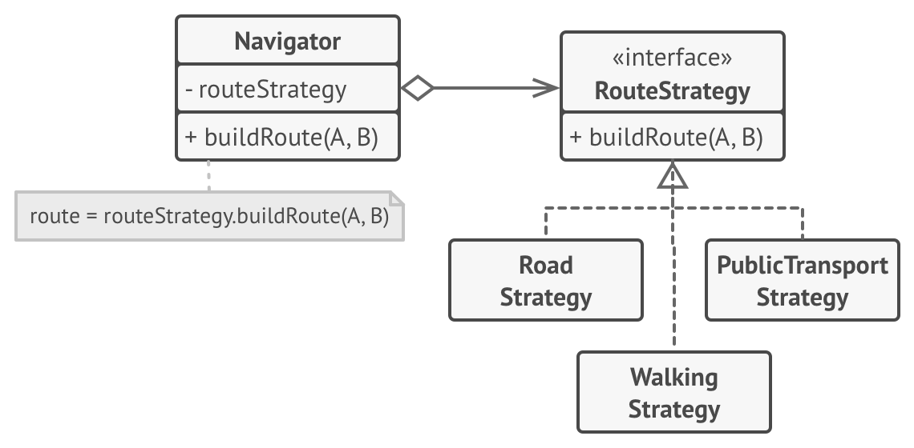

# Strategy Pattern

Strategy is a behavioral design pattern that lets you define a family of algorithms, put each of them into a separate class, and make their objects interchangeable.

## Problem
We want to build rote for navigator , but route can be either for bus, walking , car etc.

This will make buildRoute() method very complicated since different checks will be introduced within and it will be difficult to maintain and extend.

## Solution

We can create a strategy interface and then create different strategies for different types of routes. This will make the code more maintainable and extendable.
routeStrategy can be a field in navigator class, that can be populated with different strategies based on the requirement.